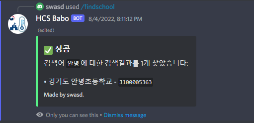

# HCS-tool
[](https://nodejs.org/ko)<br>
2022년 3월 9일에 만들어지고 2022년 8월 4일(마지막 커밋 시점)까지 계속 작동중입니다. (149일간)<br>

## 📌필독 사항
 * 학습 목적으로만 사용해주세요.
 * **개인정보를 부당한 수단이나 방법으로 취득**하여 **도용**한 경우`「개인정보 보호법」 제71조`**에 의거 처벌**받을 수 있습니다.
 * 이 프로그램을 사용하여 생긴 법적 책임은 사용한 본인에게 있습니다.
 * 이 프로그램은 자가진단의 취약점을 이용하여 만들어진 프로그램이므로 언제든 막힐 수 있습니다.

## 📗기능
 * 학교 이름으로 학교 코드를 찾아준다
 * 이름과 생년월일로 학교를 찾아준다
 * 이름, 학교, 생년으로 생일을 찾아준다

## 💡만들까 생각중인 것
 * 특정 상대 자가진단 못하게 하기

## 📥사용
> [Node.js](https://nodejs.org/ko/)와 [Discord](https://discord.com) 다운로드는 필수입니다.
1. 모듈 설치
```
npm install
```
1. config.json.example을 config.json으로 바꾼 뒤 따로 설정을 한다.<br>
**파일에 설명을 위해 주석처리를 한 부분이 있습니다. 지워주세요 ('//'과 뒤에 있는 것)**
2. 실행
```
node index.js
```
4. 디스코드 서버에 봇을 초대하고 사용하면 됨 (슬래시 커맨드).

## 📸사진
**getSchool:**<br>
<br>
**getBirthday:**<br>
<br>
**findSchool:**<br>
<br>

## 🎫라이선스
[GPLv3](https://olis.or.kr/license/Detailselect.do?lId=1072)

## 📢자가진단 개발자 분들께...
빨리 확인하시고 막으시길 바라겠습니다... ㄹㅇㅋㅋ<br> 
-- 이 밑 대충 내가 말하는 공간(?) --<br>
api에서 학교 두글자 막았네요 ㅋ
설명 귀찮으므로 생략~

**유저가 존재하고, 비밀번호가 틀릴 때** <br />
<br />
**유저가 존재하지 않을 때** <br />
<br />
백엔드를 저렇게 만들어두니, 뚫릴 수 밖에 없겠죠?
